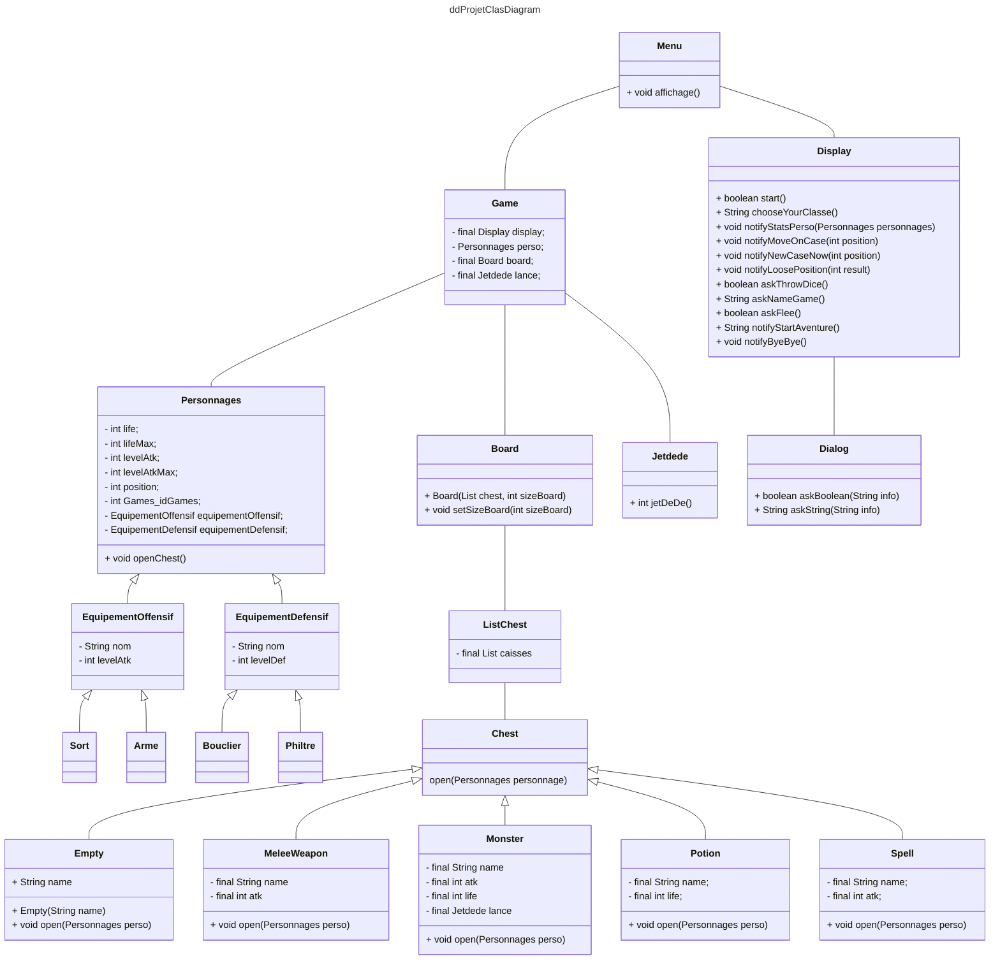

```mermaid
---
title: ddProjetClasDiagram
---
classDiagram

    Game -- Board
    Game -- Personnages
    Game -- Jetdede
    Display -- Dialog
    Menu -- Game
    Menu -- Display
    EquipementOffensif <|-- Sort
    EquipementOffensif <|-- Arme
    EquipementDefensif <|-- Bouclier
    EquipementDefensif <|-- Philtre
    Personnages <|-- EquipementDefensif
    Personnages <|-- EquipementOffensif
    Board -- ListChest
    ListChest -- Chest
    Chest <|-- Empty
    Chest <|-- MeleeWeapon
    Chest <|-- Monster
    Chest <|-- Potion
    Chest <|-- Spell
    
    class Menu {
        + void affichage()
    }
    class Dialog {
        + boolean askBoolean(String info)
        + String askString(String info)
    }
    class Game {
        - final Display display;
        - Personnages perso;
        - final Board board;
        - final Jetdede lance;
    }
    class Personnages {
        - int life;
        - int lifeMax;
        - int levelAtk;
        - int levelAtkMax;
        - int position;
        - int Games_idGames;
        - EquipementOffensif equipementOffensif;
        - EquipementDefensif equipementDefensif;
        + void openChest()
    }
    class Display {
        + boolean start()
        + String chooseYourClasse()
        + void notifyStatsPerso(Personnages personnages)
        + void notifyMoveOnCase(int position)
        + void notifyNewCaseNow(int position)
        + void notifyLoosePosition(int result)
        + boolean askThrowDice()
        + String askNameGame()
        + boolean askFlee()
        + String notifyStartAventure()
        + void notifyByeBye()
        
    }
    class Chest {
        open(Personnages personnage)
    }
    class Board {
        + Board(List<Chest> chest, int sizeBoard)
        + void setSizeBoard(int sizeBoard)
    }
    class Jetdede {
        + int jetDeDe()
    }
    class EquipementDefensif {
        - String nom
        - int levelDef
    }
    class EquipementOffensif {
        - String nom
        - int levelAtk
    }
    class ListChest {
        - final List<Chest> caisses
    }
    class Empty {
        + String name
        + Empty(String name)
        + void open(Personnages perso)
    }
    class MeleeWeapon {
        - final String name
        - final int atk
        + void open(Personnages perso)
    }
    class Monster {
        - final String name
        - final int atk
        - final int life
        - final Jetdede lance
        + void open(Personnages perso)
    }
    class Potion {
        - final String name;
        - final int life;
        + void open(Personnages perso)
    }
    class Spell {
        - final String name;
        - final int atk;
        + void open(Personnages perso)
    }
```